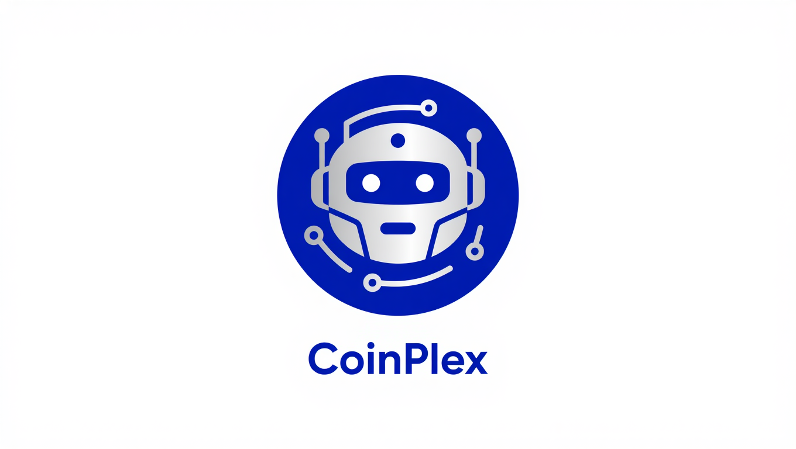

# 🤖 Crypto V2 Bot

<p align="center">
  
</p>

<p align="center">
  
  
  
  
  
</p>

یه ربات تلگرام همه‌کاره برای دنیای کریپتو. هم فارسی هم انگلیسی کار می‌کنه. قیمت لحظه‌ای، شاخص ترس و طمع، اخبار، نهنگ‌ها، کارمزد گاز اتریوم، مانیتورینگ ولت روی ۲۳ تا زنجیره EVM، قیمت تتر و دلار به تومان، و حتی یه دستیار هوش مصنوعی — همه توی یه ربات.

---

## 📋 فهرست

- [چی کار می‌کنه؟](#-چی-کار-می‌کنه)
- [دستورات](#-دستورات)
- [مانیتورینگ ولت](#-مانیتورینگ-ولت)
- [نصب](#-نصب)
- [متغیرهای محیطی](#-متغیرهای-محیطی)
- [ساختار پروژه](#-ساختار-پروژه)
- [API‌هایی که استفاده شده](#-apiهایی-که-استفاده-شده)
- [استقرار روی Railway](#-استقرار-روی-railway)
- [مجوز](#-مجوز)

---

## ✨ چی کار می‌کنه؟

### 🔸 قیمت زنده ارزها
قیمت ۲۸ تا از ارزهای برتر رو با تغییرات ۲۴ ساعت نشون میده (🟢 سبز = بالا رفته / 🔴 قرمز = پایین اومده). alias هم داره: `btc` همون `bitcoin` حساب میشه، `eth` همون `ethereum`، `sol` همون `solana`. حدود ۵۰ تا alias تعریف شده.

### 🔸 شاخص ترس و طمع (Fear & Greed)
احساسات بازار رو برای ۷ روز اخیر میاره با ایموجی: 😱 ترس شدید → 🤑 طمع شدید.

### 🔸 اخبار کریپتو
- اخبار انگلیسی از CoinDesk + CoinTelegraph گرفته میشه و کش میشه (هر ساعت آپدیت)
- برای کاربرای فارسی، خودکار عنوان‌ها با هوش مصنوعی ترجمه میشه

### 🔸 تراکنش‌های نهنگ
تراکنش‌های بالای ۱ میلیون دلار تو شبکه اتریوم رو با Etherscan API ردیابی می‌کنه.

### 🔸 کارمزد گاز اتریوم
گس رو به صورت Safe، Normal و Fast نشون میده همراه با قیمت لحظه‌ای ETH.

### 🔸 مانیتورینگ ولت (۲۳ زنجیره)
هر ولت EVM روی ۲۳ تا زنجیره مختلف رو می‌تونی زیر نظر بگیری. به محض تراکنش جدید، نوتیفیکیشن می‌فرسته تو تلگرام.

**زنجیره‌های پشتیبانی شده:** Ethereum, BSC, Polygon, Arbitrum, Optimism, Base, Avalanche, Cronos, Fantom, Gnosis, zkSync Era, Linea, Scroll, Blast, Mantle, Moonbeam, Celo, Polygon zkEVM, Aurora, Metis, HyperEVM, Unichain, Robinhood Chain

### 🔸 قیمت تومان
قیمت لحظه‌ای USDT و USD به تومان از والکس (Wallex).

### 🔸 منوی تعاملی
همه چیز از طریق دکمه‌های شیشه‌ای داخل تلگرام قابل دسترسیه. دکمه refresh هم داره برای آپدیت کردن.

### 🔸 دستیار هوش مصنوعی
- با `/ask <سوال>` یا هر متنی که بفرستی (free-form) جواب می‌ده
- جواب‌های تخصصی در مورد بلاکچین، دیفای، تحلیل بازار و...
- فارسی یا انگلیسی — بر اساس زبانی که انتخاب کردی
- با مدل `gpt-5.4-mini` از طریق freemodel.dev

### 🔸 دو زبانه
کامل فارسی و انگلیسی. اولین بار که `/start` می‌زنی زبان رو انتخاب می‌کنی، بعدا با `/lang` می‌تونی عوضش کنی.

---

## 📖 دستورات

| دستور | توضیح | مثال |
|-------|-------|------|
| `/start` | شروع ربات و انتخاب زبان | `/start` |
| `/help` | راهنما | `/help` |
| `/price [coin...]` | قیمت یک یا چند ارز | `/price btc eth sol` |
| `/fng` | شاخص ترس و طمع | `/fng` |
| `/news` | آخرین اخبار | `/news` |
| `/whale` | تراکنش‌های نهنگ | `/whale` |
| `/gas` | کارمزد گاز اتریوم | `/gas` |
| `/toman` | قیمت تتر و دلار به تومان | `/toman` |
| `/ask <question>` | سوال از هوش مصنوعی | `/ask what is DeFi?` |
| `/watch <address> [chain]` | شروع مانیتورینگ یه ولت | `/watch 0x... eth` |
| `/unwatch <address> [chain]` | توقف مانیتورینگ | `/unwatch 0x...` |
| `/wallets` | لیست ولت‌های تحت نظر | `/wallets` |
| `/check` | اسکن دستی ولت‌ها | `/check` |
| `/lang` | تغییر زبان | `/lang` |

اگر متنی بفرستی که دستور نباشه، باز هم هوش مصنوعی جواب میده.

---

## 👁 مانیتورینگ ولت

می‌تونی هر ولت EVM رو روی ۲۳ تا زنجیره زیر نظر بگیری. به محض اینکه تراکنش جدیدی انجام بشه، تو تلگرام نوتیفیکیشن می‌گیری.

```
/watch 0x742d35Cc6634C0532925a3b844Bc9e7595f2bD18     → روی هر ۲۳ تا زنجیره
/watch 0x742d35Cc6634C0532925a3b844Bc9e7595f2bD18 bsc → فقط روی BSC
/wallets                                                 → لیست ولت‌ها
/unwatch 0x742d35Cc6634C0532925a3b844Bc9e7595f2bD18     → حذف از لیست
/check                                                   → اسکن همين الان
```

**چطور کار می‌کنه:** ربات هر ۱۵ ثانیه یکبار ولت‌ها رو از طریق Covalent API چک می‌کنه. اگه تراکنش جدیدی باشه (دریافتی یا ارسالی، کوین اصلی یا توکن)، یه نوتیفیکیشن می‌فرسته با:
- 🔔 نوع تراکنش (Native / Token)
- 💱 مقدار و نماد
- 📤 آدرس فرستنده
- 📥 آدرس گیرنده
- 🔗 لینک به block explorer

همه چیز خودکاره و با job queue هندل میشه.

---

## 🛠 نصب

### پیش‌نیازها
- Python 3.10+
- pip
- (اختیاری) API Key رایگان از منابع زیر

### مراحل

```bash
# 1. کلون کن
git clone https://github.com/dormani9/crypto-bot-v2.git
cd crypto-bot-v2

# 2. محیط مجازی (توصیه میشه)
python -m venv venv
# ویندوز:
venv\Scripts\activate
# لینوکس/مک:
source venv/bin/activate

# 3. نصب وابستگی‌ها
pip install -r requirements.txt

# 4. فایل .env رو بساز
copy .env.example .env   # ویندوز
cp .env.example .env     # لینوکس/مک

# 5. توکن ربات و API Keyها رو توی .env وارد کن

# 6. اجرا
python main.py
```

---

## 🔐 متغیرهای محیطی

| متغیر | الزامی | توضیح | از کجا بیارم؟ |
|-------|--------|-------|---------------|
| `TELEGRAM_BOT_TOKEN` | ✅ بله | توکن ربات تلگرام | [BotFather](https://t.me/BotFather) |
| `COVALENT_API_KEY` | ✅ برای مانیتورینگ ولت | کلید Covalent API (۲۳ زنجیره) | [Covalent](https://www.covalenthq.com/) |
| `COINGECKO_API_KEY` | ❌ اختیاری | نرخ بیشتر برای قیمت‌ها | [CoinGecko](https://www.coingecko.com/en/api) |
| `FREEMODEL_API_KEY` | ❌ اختیاری | هوش مصنوعی (رایگان) | [freemodel.dev](https://freemodel.dev) |
| `ETHERSCAN_API_KEY` | ❌ اختیاری | گاز و نهنگ | [Etherscan](https://etherscan.io/myapikey) |
| `BLOCKSCOUT_API_KEY` | ❌ اختیاری | Blockscout Pro (Robinhood Chain) | [Blockscout](https://blockscout.com) |

> بدون `COVALENT_API_KEY` مانیتورینگ ولت کار نمی‌کنه. بدون `FREEMODEL_API_KEY` هوش مصنوعی کار نمی‌کنه. بقیه ویژگی‌ها بدون API Key هم راه می‌افتن.

---

## 📁 ساختار پروژه

```
crypto-bot-v2/
├── main.py                  # نقطه ورود
├── utils.py                 # توابع کمکی: قیمت CoinGecko، قیمت تومان، COIN_ALIASES
├── lang.py                  # دیکشنری دو زبانه فارسی/انگلیسی
├── requirements.txt         # وابستگی‌ها
├── .env.example             # نمونه فایل محیطی
├── wallet-monitor.json      # ولت‌های تحت نظر (ساخته میشه)
├── last-block.json          # آخرین بلاک چک شده (ساخته میشه)
├── README.md                # همین فایل
│
└── handlers/                # ماژول‌های هندلر
    ├── start.py             # /start + /help + /lang + منوی اصلی
    ├── price.py             # /price + /alert
    ├── news.py              # /news — کش شده CoinDesk + CoinTelegraph
    ├── fng.py               # /fng — شاخص ترس و طمع
    ├── whale.py             # /whale — تراکنش‌های نهنگ
    ├── gas.py               # /gas — کارمزد گاز
    ├── toman.py             # /toman — قیمت تومان
    ├── watch.py             # /watch, /unwatch, /wallets, /check
    ├── ai.py                # /ask — هوش مصنوعی
    ├── menu.py              # منوی تعاملی
```

### جریان کار

```
کاربر → /start → انتخاب زبان → منوی اصلی
    ├── 🔹 قیمت (menu_price) ← CoinGecko
    ├── 🔹 ترس و طمع (menu_fng) ← alternative.me
    ├── 🔹 تومان (menu_toman) ← Wallex
    ├── 🔹 اخبار (menu_news) ← RSS + ترجمه AI
    ├── 🔹 نهنگ (menu_whale) ← Etherscan
    ├── 🔹 گاز (menu_gas) ← Etherscan
    ├── 🔹 ولت (menu_wallet) ← Covalent API (۲۳ زنجیره)
    └── 🔹 هوش مصنوعی (menu_ai) ← freemodel.dev
```

---

## 🌐 API‌هایی که استفاده شده

| سرویس | کاربرد | مستندات | لایسنس |
|-------|--------|---------|--------|
| **Covalent** | مانیتورینگ ولت روی ۲۳ زنجیره | [docs](https://www.covalenthq.com/docs/api/) | رایگان (۷۵k درخواست ماه) |
| **CoinGecko** | قیمت لحظه‌ای ۲۸+ ارز | [docs](https://docs.coingecko.com) | رایگان با API Key |
| **Etherscan v2** | گس و تراکنش نهنگ | [docs](https://docs.etherscan.io) | رایگان |
| **alternative.me** | شاخص ترس و طمع | [docs](https://alternative.me/crypto/fear-and-greed-index) | رایگان |
| **freemodel.dev** | هوش مصنوعی (gpt-5.4-mini) | [freemodel.dev](https://freemodel.dev) | رایگان |
| **Wallex** | قیمت USDT/Toman | [wallex.ir](https://wallex.ir) | رایگان |
| **CoinDesk / CoinTelegraph** | اخبار انگلیسی (RSS) | — | RSS رایگان |

---

## 🚀 استقرار روی Railway

ربات روی Railway اجرا میشه. مراحل:

1. مخزن رو به GitHub پوش کن
2. تو [Railway](https://railway.app) یه پروژه جدید بساز و به مخزن گیت‌هات وصل کن
3. تو تنظیمات Railway، متغیرهای محیطی رو اضافه کن:
   - `TELEGRAM_BOT_TOKEN`
   - `COVALENT_API_KEY`
   - `COINGECKO_API_KEY` (اختیاری)
   - `FREEMODEL_API_KEY` (اختیاری)
   - `ETHERSCAN_API_KEY` (اختیاری)
   - `BLOCKSCOUT_API_KEY` (اختیاری)
4. Railway خودکار `pip install -r requirements.txt` و `python main.py` رو اجرا می‌کنه
5. هر بار به گیت‌هاب پوش کنی، خودکار دیپلوی میشه

> نکته: نوبیتکس و بیت‌۲۴ روی Railway DNS مسدود شدن. والکس تنها منبع قابل اعتماد برای قیمت تومانه.

---

## 🤝 مشارکت

PR و Issue خوش اومد. قبل از فرستادن PR:
- کد رو تست کن
- تمیز باشه
- commit message رو واضح بنویس

---

## 📝 مجوز

این پروژه تحت مجوز MIT منتشر شده.

---

## 🙏 تشکر ویژه

<p align="center">
  <a href="https://github.com/Misagh95/">
    
  </a>
</p>

Special thanks to **Misagh** for his collaboration and support on this project.

---

<p align="center">
  ساخته شده با ❤️ برای جامعه کریپتو
</p>
